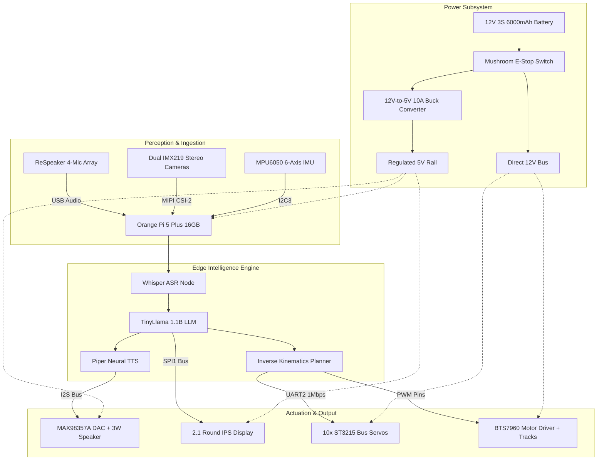

# Nexus-7: Autonomous Humanoid Edge-AI Robotic Assistant

-purple.svg)
-blue.svg)

I designed and engineered Nexus-7, an autonomous edge-AI humanoid robotic assistant featuring an articulated 10-DOF upper torso mounted on a heavy-duty continuous crawler track chassis.

Unlike standard cloud-dependent bots, Nexus-7 executes local conversational intelligence, speech-to-text, neural speech synthesis, and stereo spatial depth mapping entirely offline on the integrated 6 TOPS NPU and 16GB RAM of an Orange Pi 5 Plus.

---

## Technical Highlights

* **High-Torque Serial Bus Kinematics:** 10x Waveshare ST3215 magnetic encoder servos deliver up to 30kg.cm holding torque per joint, providing 12-bit positional telemetry, thermal tracking, and closed-loop control over a single 1Mbps half-duplex UART bus.
* **Autonomous Edge-AI Intelligence:** Powered by an Orange Pi 5 Plus (RK3588, 16GB RAM) running local quantized small language models (TinyLlama 1.1B / Llama-3.2-1B) directly on the 6 TOPS NPU without internet or cloud subscriptions.
* **Far-Field Spatial Audio Array:** The ReSpeaker 4-mic hardware array calculates real-time Direction of Arrival (DoA) sound vectors to physically steer the head toward the speaker before passing noise-filtered audio into local Whisper ASR.
* **Expressive Vision & Display Pipeline:** Dual MIPI CSI-2 IMX219 stereo cameras calculate 3D disparity depth maps for object tracking, paired with a 2.1-inch 480x480 round SPI IPS display running hardware-accelerated LVGL facial animations.
* **Inductive Transient Suppression:** A 1000µF 25V low-ESR electrolytic capacitor across the 12V high-current motor bus prevents inductive back-EMF spikes generated by track reversals and rapid servo deceleration.

---

## 3D Printed Parts Specification

Parts printed in PETG and SLA resin for mechanical mounting on the aluminum chassis:

1. Upper Torso & Internal Electronics Cage
   ( `cad/torso_skeleton.step` ):
   * Material: Structural PETG (40% infill, 4 perimeters, 0.20mm layer height)
   * Purpose: Houses the Orange Pi 5 Plus, synchronous buck converter, and distributes mechanical arm loads safely to the tracked chassis.

2. Articulated Head & Circular HUD Housing
   ( `cad/head_gimbal_mount.step` ):
   * Material: PETG (25% infill, 3 perimeters, 0.16mm layer height)
   * Purpose: Holds the 2.1" round IPS display, dual IMX219 stereo depth cameras, and the 2-DOF pan/tilt neck servo horns.

3. Underactuated Compliant Hands & Tendon Phalanges
   ( `cad/hand_fingers_assembly.step` ):
   * Material: High-Strength PETG (60% infill, 4 perimeters, 0.16mm layer height)
   * Purpose: Rigid finger hinges with internal cable guide tunnels allowing single-servo tendon actuation to conform around objects of irregular shape.

---

## Assembly & Build Procedure

### 1. Fabrication & Dry Fit
* Print the torso skeleton, head mount, and finger phalanges on the 3D printer using PETG filament.
* Press M3 brass heat-set threaded inserts into structural mounting holes using a soldering iron set to 230°C.
* Inspect edges of the aluminum base plates and test-fit all 10 ST3215 servo brackets before final assembly.

### 2. Wiring & Soldering
* Solder the main battery leads with the inline 40A mushroom E-stop cutoff switch directly on the positive rail.
* Solder the 1000µF 25V low-ESR capacitor across the 12V power input pads of the BTS7960 motor driver.
* Wire the 12V-to-5V 10A buck converter input to the switched 12V rail and output clean 5V to the Orange Pi 5 Plus.
* Connect UART2 (Pins 8 and 10) to the Waveshare bus servo interface board.
* Wire the BTS7960 track motor driver PWM inputs to GPIO pins 35, 36, 37, and 38.
* Connect the 2.1" round IPS display via high-speed SPI1 (Pins 19, 23, 24).
* Wire the MAX98357A I2S DAC amplifier to I2S0 (Pins 12, 33, 40) and connect the 3W cavity speaker.
* Check continuity across power and ground rails with a multimeter to ensure zero short circuits before plugging in the battery.

### 3. Firmware Configuration & Bring-Up
* Flash Ubuntu 22.04 LTS onto the 256GB PCIe NVMe SSD and boot the Orange Pi 5 Plus.
* Enable hardware overlays for UART2, SPI1, and I2S0 in `orangepi-config`.
* Deploy the local quantized model (`tinyllama:1.1b`) via Ollama targeting the onboard RK3588 NPU.
* Configure Piper neural text-to-speech for local real-time audio generation.
* Set servo bus communication to 1,000,000 baud and calibrate joint zero-points.
* Execute `python3 scripts/main_robot.py` to start the autonomous control and perception loop.

---

## Project Flowchart

---

## Bill of Materials Summary

Total Hardware Cost Requested: **$577.00**  
(Full itemized table in [`BOM.csv`](./BOM.csv)).

---

## License

Distributed under the MIT License. See [`LICENSE`](./LICENSE) for details.
